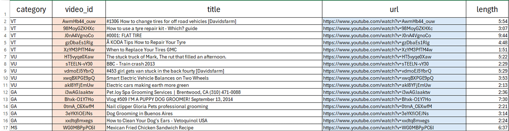
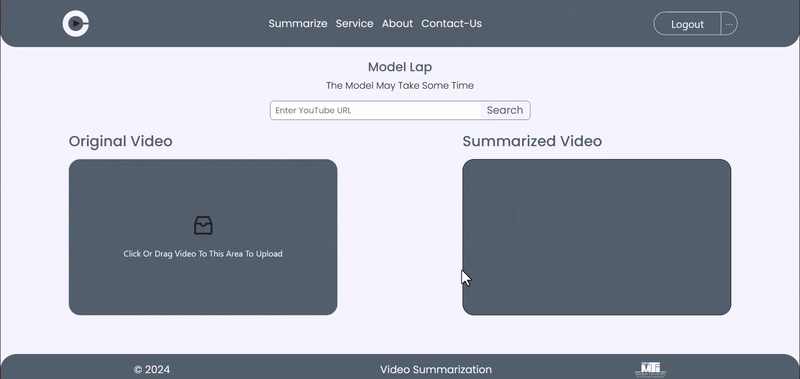

# Video Summarization app

> A Video Summarization tool that highlights key segments of a video and generates a concise summarized video.

## Description

A video summarization application that employs state-of-the-art deep learning techniques to analyze and condense lengthy videos into concise summaries. The user-friendly interface facilitates easy interaction with the tool. This project builds the summarization algorithm on established techniques from previous research, including [Patel, K., & Singh, M. (2021). DSNet: A Flexible Detect-to-Summarize Network for Video Summarization](https://liplus.me/publication/dsnet/dsnet.pdf) and [Garcia, P., & Lee, D. (2019). Summarizing Videos with Attention](https://arxiv.org/pdf/1812.01969). While these works laid the foundation, significant effort was invested in understanding their methodologies and adapting their implementations to create an effective application.

## Project Architecture

### 1- Data Collection and preprocessing

After comparing benchmark datasets in the video summarization domain, we selected [TvSum](https://github.com/yalesong/tvsum) due to its decent number of videos and annotators for keyframe scores compared to other datasets. Additionally, instead of using widely available extracted features, we reprocessed the videos and extracted features ourselves to streamline the inference process later.

### 2- Model Architechture

After Using pretrained models (VGG, GoogLeNet, ResNet) for Feature Extraction and various deep learning architectures (Perceptron, LSTM, GRU, and Self-Attention) for Summary Prediction, we ultimately chose to implement GoogLeNet combined with Self-Attention after evaluating the performance of each model.

### 3- Application Architechture

We built a web application with a React frontend that interacts with two backend systems: a Python backend for video processing and summarization, and a Laravel backend for managing user accounts, subscriptions, and application logic. MySQL is utilized for handling user data and subscriptions.

## Porject Presentation

The project is detailed in a presentation Video Summarization.pptx covering Project topics, including the Introduction, Motivation, Problem Definition, Project Objective, Related Works, Background, Developed Solution, Project Methodology, Experimental Results, Web Application Demo, Future Work, and References.

## Acknowledgments

I am grateful for the contributions of previous work, including detailed papers and publicly available repositories:

- E. Apostolidis · (2021) - [Video Summarization: A Survey](https://arxiv.org/pdf/2101.06072)
- W. Zhu · (2021) - [DSNet A Flexible Detect-to-Summarize Network](https://liplus.me/publication/dsnet/dsnet.pdf)
- J. Fajtl · (2018) - [Summarizing Videos with Attention](https://arxiv.org/pdf/1812.01969)
- [KTS](https://github.com/pathak22/videoseg/tree/master/lib/kts) - Repository for scene detection algorithm
- [DSNet](https://github.com/li-plus/DSNet) - Repository for data loading and model training implementation.

Special thanks to Eyad Shawky for contributing to this project by building an impressive interface for the model. ❤

## Authors

- **Mohammed Shady** - _GitHub Profile_: [mohammedshady](https://github.com/mohammedshady) | _Email_: mohatech777@gmail.com
- **Eyad Shawky** - _GitHub Profile_: [Eyad Shawky](https://github.com/EyadShawky) | _Email_: eyadshawky0@gmail.com

If you encounter any issues or have suggestions for improvements, please reach out via email. Your feedback is valuable and helps us enhance the app for everyone.
